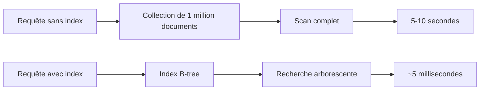
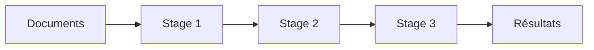
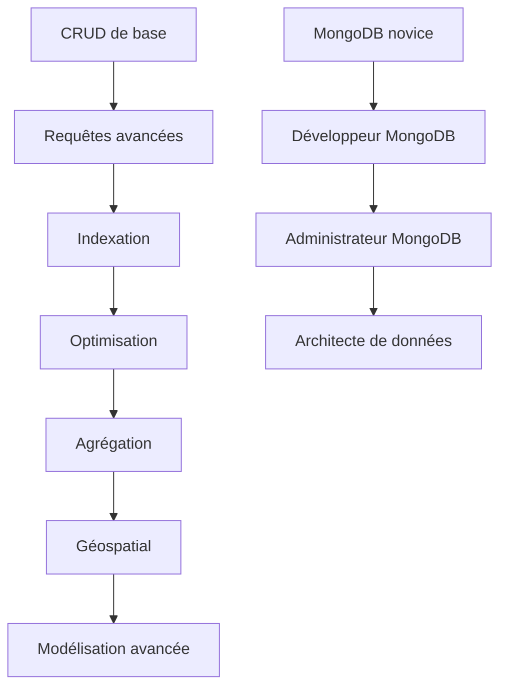

---
# Vous pouvez modifier le thème si nécessaire encore une fois chers etudiants d'ISITECH, soyez curieux...
theme: default
# Image de fond (optionnelle)
background: https://source.unsplash.com/collection/94734566/1920x1080
# Information sur la présentation (markdown autorisé)
title: Formation MongoDB - Jour 1 (Suite)
info: |
  ## Formation MongoDB - Jour 1 (Suite)
  Indexation, Agrégation et Requêtes Géospatiales

  Pour les étudiants du module UA3-14
# Appliquer des classes unocss à la slide courante
class: text-center
# Transitions entre slides
transition: slide-left
# Active la syntaxe MDC
mdc: true
---

# Formation MongoDB
## Jour 2 : Indexation, Agrégation et Géospatial

<div class="pt-12">
  <span class="px-2 py-1 rounded cursor-pointer" hover="bg-white bg-opacity-10">
    Appuyez sur Espace pour passer à la slide suivante <carbon:arrow-right class="inline"/>
  </span>
</div>

<div class="abs-br m-6 flex gap-2">
  <a href="https://mongodb.com" target="_blank" class="text-xl icon-btn opacity-50 !border-none !hover:text-white">
    <carbon:logo-github />
  </a>
</div>

---
layout: center
class: text-center
---

# Indexation et Optimisation des Performances

Améliorer les performances de vos requêtes MongoDB

---
transition: fade-out
---

# Pourquoi indexer vos données?

<div class="grid grid-cols-2 gap-4 mt-4">
<div>

## Sans index

- MongoDB parcourt chaque document (COLLSCAN)
- Performances linéaires : O(n)
- Problématique sur les grandes collections
- Consomme beaucoup de ressources
- Temps de réponse très lent

</div>
<div>

## Avec index

- Améliore drastiquement les requêtes
- Structure de données efficace (B-tree)
- Algorithme de recherche optimisé
- Performances logarithmiques : O(log n)
- Nécessaire pour les applications en production

</div>
</div>

<div v-click>

## Impact concret des index



</div>

---

# Types d'index dans MongoDB

<div class="grid grid-cols-2 gap-4">
<div>

## Index simples

- Index sur un seul champ
- Ascendant (1) ou descendant (-1)
- Le plus courant et simple à mettre en place

```javascript
// Création d'un index simple
db.utilisateurs.createIndex({ nom: 1 })

// Index descendant
db.produits.createIndex({ date: -1 })
```

## Index composites

- Index sur plusieurs champs
- Ordre des champs important
- Utile pour les requêtes multichamps

```javascript
// Index composite
db.clients.createIndex({ 
  pays: 1, 
  ville: 1, 
  code_postal: 1 
})
```

</div>
<div>

## Index spécialisés

- **Multikey** : Indexe chaque élément d'un tableau
```javascript
db.articles.createIndex({ tags: 1 })
```

- **Text** : Recherche textuelle full-text
```javascript
db.articles.createIndex({ contenu: "text" })
```

- **Hashed** : Distribution uniforme pour le sharding
```javascript
db.utilisateurs.createIndex({ _id: "hashed" })
```

- **Wildcard** : Indexe dynamiquement des champs
```javascript
db.produits.createIndex({ "metadata.$**": 1 })
```

- **TTL** (Time-To-Live) : Expire automatiquement
```javascript
db.sessions.createIndex(
  { derniere_activite: 1 },
  { expireAfterSeconds: 3600 }
)
```

</div>
</div>

---

# Création et gestion des index

<div class="grid grid-cols-2 gap-4">
<div>

## Création d'index

```javascript
// Index simple avec options
db.produits.createIndex(
  { nom: 1 },
  { 
    background: true,
    unique: true,
    sparse: false,
    name: "idx_nom"
  }
)
```

## Options importantes

- **background**: Création en arrière-plan
- **unique**: Valeurs uniques uniquement
- **sparse**: Ignore les documents sans le champ
- **partialFilterExpression**: Indexe un sous-ensemble
- **name**: Nom personnalisé pour l'index

</div>
<div>

## Administration des index

```javascript
// Lister tous les index d'une collection
db.produits.getIndexes()

// Statistiques d'utilisation des index
db.produits.aggregate([
  { $indexStats: {} }
])

// Supprimer un index
db.produits.dropIndex("idx_nom")

// Reconstruire tous les index
db.produits.reIndex()
```

## Bonnes pratiques

- Indexer les champs utilisés fréquemment en filtres
- Indexer les champs de tri et d'agrégation
- L'ordre des champs doit correspondre aux requêtes
- Faire attention à la taille des index en mémoire
- Éviter les index inutilisés ou redondants

</div>
</div>

---

# Analyse des performances avec explain()

<div class="grid grid-cols-2 gap-4">
<div>

## Modes d'explain()

```javascript
// Mode queryPlanner (par défaut)
db.utilisateurs.find({ age: { $gt: 25 } })
  .explain()

// Mode executionStats
db.utilisateurs.find({ age: { $gt: 25 } })
  .explain("executionStats")

// Mode allPlansExecution
db.utilisateurs.find({ age: { $gt: 25 } })
  .explain("allPlansExecution")
```

## Étapes d'exécution (stages)

- **COLLSCAN** : Scan complet (problématique)
- **IXSCAN** : Utilisation d'un index
- **FETCH** : Récupération des documents
- **SORT** : Tri en mémoire (coûteux)
- **LIMIT** : Limitation du nombre de résultats
- **SKIP** : Saut de documents

</div>
<div>

## Métrique à surveiller

- **nReturned** : Nombre de documents retournés
- **totalKeysExamined** : Entrées d'index examinées
- **totalDocsExamined** : Documents examinés
- **executionTimeMillis** : Temps d'exécution
- **stage** : Type d'opération utilisée

## Interprétation

- Idéal : totalKeysExamined ≈ nReturned
- Problème : totalDocsExamined >> nReturned
- Signe de couverture d'index : totalDocsExamined = 0
- Signe de problème : COLLSCAN sur grande collection

<div class="mt-4 text-sm">
💡 Utilisez explain() régulièrement dans votre cycle de développement et avant toute mise en production.
</div>

</div>
</div>

---

# Index couvrants et optimisations avancées

<div class="grid grid-cols-2 gap-4">
<div>

## Index couvrants (Covered Queries)

Quand un index contient tous les champs nécessaires :
- Pas besoin d'accéder aux documents
- Performances maximales
- Visible dans explain() : stage = IXSCAN, totalDocsExamined = 0

```javascript
// Créer un index composite
db.produits.createIndex({ categorie: 1, prix: 1 })

// Requête couverte par l'index
db.produits.find(
  { categorie: "electronique" },
  { prix: 1, _id: 0 }
)
```

## Projections et limitations

```javascript
// Projection optimisée
db.produits.find(
  { categorie: "electronique" },
  { nom: 1, prix: 1 }
).limit(20)
```

</div>
<div>

## Techniques d'optimisation

- **Filtres sélectifs d'abord** : placez les filtres les plus restrictifs en premier dans vos index composites
```javascript
// Meilleur pour filtrer par statut puis trier par date
db.commandes.createIndex({ statut: 1, date: -1 })
```

- **Éviter les regexp avec préfixe générique**
```javascript
// Inefficace avec index
db.produits.find({ nom: /.*phone/ })
// Efficace avec index
db.produits.find({ nom: /^iphone/ })
```

- **Indexation par anticipation**
Pour les applications prévisibles, indexez en fonction des besoins futurs

- **Indexes partiels**
```javascript
// Index uniquement les produits actifs
db.produits.createIndex(
  { prix: 1 },
  { partialFilterExpression: { actif: true } }
)
```

</div>
</div>

---

# Stratégies d'indexation en production

<div class="grid grid-cols-2 gap-4">
<div>

## Analyse des requêtes

- Utilisez le profiler MongoDB pour identifier les requêtes lentes
```javascript
db.setProfilingLevel(1, { slowms: 100 })
db.getProfilingStatus()
db.system.profile.find().sort({ millis: -1 })
```

- Log des requêtes lentes
```javascript
db.adminCommand({
  setParameter: 1,
  slowOpThresholdMs: 100
})
```

## Création d'index en production

- Utilisez toujours `background: true`
- Planifiez pendant les heures creuses
- Surveillez l'utilisation CPU et mémoire
- Prévoyez de l'espace disque supplémentaire
- Testez sur un environnement de pré-production

</div>
<div>

## Maintenance des index

- Audit périodique des index
```javascript
// Trouver les index non utilisés
db.collection.aggregate([
  { $indexStats: {} }
]).forEach(idx => {
  if (idx.accesses.ops == 0) {
    print(`Index inutilisé: ${idx.name}`);
  }
})
```

- Consolidation des index similaires
- Suppression des index redondants
- Défragmentation via `reIndex()`

## Limites et considérations

- Limite de 64 index par collection
- Impact sur les performances d'écriture
- Consommation mémoire (working set)
- Taille des index : ~0.5% à 3% de la taille des données
- Latence pour la création d'index (blocage potentiel)

</div>
</div>

---
layout: center
class: text-center
---

# Le Framework d'Agrégation

Analyse avancée et transformation des données

---

# Introduction au Framework d'Agrégation

<div class="grid grid-cols-2 gap-4">
<div>

## Qu'est-ce que l'agrégation?

- Framework puissant pour traiter et analyser les données
- Alternative MongoDB aux opérations JOIN et GROUP BY du SQL
- Pipeline de traitement par étapes
- Transformation des données en flux
- Analyse complexe directement dans la base de données

## Cas d'usage

- Statistiques et rapports
- Analyse de données en temps réel
- Transformation de données
- Calculs et regroupements complexes
- Préparation de données pour visualisation

</div>
<div>

## Avantages sur MapReduce

- Performance significativement meilleure
- Syntaxe plus accessible et lisible
- Plus flexible et expressif
- Optimisé par le moteur MongoDB
- Compatible avec les index

## Le concept de pipeline



- Série d'étapes (stages) appliquées séquentiellement
- Chaque étape transforme les documents
- Le résultat d'une étape est l'entrée de la suivante
- Traitement en mémoire avec optimisations

</div>
</div>

---

# Structure du Pipeline d'Agrégation

<div class="grid grid-cols-2 gap-4">
<div>

## Syntaxe de base

```javascript
db.collection.aggregate([
  { $stage1: { /* paramètres */ } },
  { $stage2: { /* paramètres */ } },
  /* ... plus d'étapes ... */
])
```

## Étapes principales (Stages)

- **$match** : Filtre les documents (comme find())
- **$group** : Regroupe par clé(s) et applique des opérations
- **$project** : Sélectionne et transforme les champs
- **$sort** : Trie les résultats
- **$limit** et **$skip** : Pagination
- **$unwind** : "Déplie" les tableaux
- **$lookup** : Joint avec une autre collection

</div>
<div>

## Options d'agrégation

```javascript
db.collection.aggregate(
  [ /* pipeline */ ],
  {
    allowDiskUse: true,
    maxTimeMS: 60000,
    collation: { locale: "fr" },
    hint: { indexName: 1 }
  }
)
```

## Considérations importantes

- Limite de 100MB par étape (sauf avec allowDiskUse)
- Traitement document par document
- Utilisation des index uniquement aux premières étapes
- Optimisation de l'ordre des étapes
- Complexité croissante avec la taille des données
- Possibilité de créer une vue basée sur une agrégation

</div>
</div>

---

# $match et $project : Filtrage et Projection

<div class="grid grid-cols-2 gap-4">
<div>

## $match - Filtrage des documents

Similaire à find() mais dans un pipeline d'agrégation:

```javascript
db.ventes.aggregate([
  { 
    $match: { 
      date: { $gte: new Date("2023-01-01") },
      montant: { $gt: 100 },
      statut: "complété"
    } 
  }
])
```

### Bonnes pratiques
- Placer $match au début du pipeline pour:
  - Réduire le nombre de documents traités
  - Utiliser les index disponibles
  - Améliorer les performances globales
- Utiliser les mêmes opérateurs que dans find()

</div>
<div>

## $project - Transformation des champs

Restructure les documents de sortie:

```javascript
db.clients.aggregate([
  {
    $project: {
      // Inclusion/exclusion
      _id: 0,
      nomComplet: 1,
      
      // Création de nouveaux champs
      nomComplet: { $concat: ["$prenom", " ", "$nom"] },
      
      // Calculs
      age: { $subtract: [2023, "$annee_naissance"] },
      
      // Conditions
      categorie: {
        $cond: { 
          if: { $gte: ["$points", 1000] }, 
          then: "premium", 
          else: "standard" 
        }
      }
    }
  }
])
```

### Fonctionnalités
- Sélection de champs spécifiques
- Création de nouveaux champs
- Calculs et manipulations
- Expressions conditionnelles
- Transformation de types

</div>
</div>

---

# $group : Regroupement et Agrégation

<div class="grid grid-cols-2 gap-4">
<div>

## Principe de base

Regroupe les documents par clé(s) et applique des opérateurs d'accumulation:

```javascript
db.ventes.aggregate([
  {
    $group: {
      _id: "$categorie", // Champ de regroupement
      
      // Accumulateurs
      total: { $sum: "$montant" },
      count: { $sum: 1 },
      moyenne: { $avg: "$montant" },
      min: { $min: "$montant" },
      max: { $max: "$montant" }
    }
  }
])
```

## Groupement par plusieurs champs

```javascript
db.ventes.aggregate([
  {
    $group: {
      _id: { 
        annee: { $year: "$date" },
        mois: { $month: "$date" },
        categorie: "$categorie"
      },
      total: { $sum: "$montant" }
    }
  }
])
```

</div>
<div>

## Opérateurs d'accumulation

- **$sum** : Somme des valeurs
- **$avg** : Moyenne des valeurs
- **$min** et **$max** : Valeurs extrêmes
- **$first** et **$last** : Premier/dernier document
- **$push** : Crée un tableau avec toutes les valeurs
- **$addToSet** : Tableau de valeurs uniques
- **$stdDevPop** et **$stdDevSamp** : Écarts-types

## Exemple avancé : Analyse des ventes

```javascript
db.ventes.aggregate([
  { $match: { date: { $gte: new Date("2023-01-01") } } },
  {
    $group: {
      _id: {
        mois: { $month: "$date" },
        categorie: "$categorie"
      },
      total: { $sum: "$montant" },
      nbVentes: { $sum: 1 },
      panier_moyen: { $avg: "$montant" },
      clients: { $addToSet: "$client_id" }
    }
  },
  {
    $project: {
      mois: "$_id.mois",
      categorie: "$_id.categorie",
      total: 1,
      nbVentes: 1,
      panier_moyen: 1,
      nb_clients_uniques: { $size: "$clients" }
    }
  },
  { $sort: { mois: 1, total: -1 } }
])
```

</div>
</div>

---

# $unwind et $lookup : Tableaux et Jointures

<div class="grid grid-cols-2 gap-4">
<div>

## $unwind - Décomposition de tableaux

Génère un document pour chaque élément d'un tableau:

```javascript
// Document initial
{
  _id: 1,
  produit: "Ordinateur",
  tags: ["électronique", "informatique", "bureau"]
}

// Après $unwind
db.produits.aggregate([
  { $unwind: "$tags" }
])

// Résultat: 3 documents
{ _id: 1, produit: "Ordinateur", tags: "électronique" }
{ _id: 1, produit: "Ordinateur", tags: "informatique" }
{ _id: 1, produit: "Ordinateur", tags: "bureau" }
```

### Options
```javascript
{ 
  $unwind: {
    path: "$tags",
    preserveNullAndEmptyArrays: true,
    includeArrayIndex: "position"
  }
}
```

</div>
<div>

## $lookup - Jointure entre collections

Équivalent du JOIN SQL dans MongoDB:

```javascript
db.commandes.aggregate([
  {
    $lookup: {
      from: "clients",           // Collection à joindre
      localField: "client_id",   // Champ de la collection actuelle
      foreignField: "_id",       // Champ de la collection jointe
      as: "client_info"          // Nom du tableau résultant
    }
  },
  // Optionnel: transformer le tableau en objet
  {
    $addFields: {
      client_info: { $arrayElemAt: ["$client_info", 0] }
    }
  }
])
```

### $lookup avec pipeline (MongoDB 5.0+)
```javascript
db.commandes.aggregate([
  {
    $lookup: {
      from: "produits",
      let: { produit_ids: "$produits.id" },
      pipeline: [
        { 
          $match: { 
            $expr: { $in: ["$_id", "$$produit_ids"] } 
          }
        },
        { $project: { nom: 1, prix: 1, stock: 1 } }
      ],
      as: "details_produits"
    }
  }
])
```

</div>
</div>

---

# Étapes d'agrégation avancées

<div class="grid grid-cols-2 gap-4">
<div>

## $facet - Agrégations multiples

Exécute plusieurs pipelines en parallèle:

```javascript
db.ventes.aggregate([
  {
    $facet: {
      // Pipeline 1: Top produits
      "top_produits": [
        { $group: { _id: "$produit", total: { $sum: "$montant" } } },
        { $sort: { total: -1 } },
        { $limit: 5 }
      ],
      
      // Pipeline 2: Stats mensuelles
      "stats_mensuelles": [
        {
          $group: {
            _id: { $month: "$date" },
            ventes: { $sum: "$montant" }
          }
        },
        { $sort: { "_id": 1 } }
      ],
      
      // Pipeline 3: Count par statut
      "par_statut": [
        { $group: { _id: "$statut", count: { $sum: 1 } } }
      ]
    }
  }
])
```

</div>
<div>

## Autres étapes avancées

- **$bucket** et **$bucketAuto** : Répartition en intervalles
```javascript
{ $bucket: {
    groupBy: "$age",
    boundaries: [0, 18, 30, 50, 65, 100],
    default: "autres",
    output: { "count": { $sum: 1 } }
}}
```

- **$graphLookup** : Requêtes récursives (hiérarchies)
```javascript
{ $graphLookup: {
    from: "employes",
    startWith: "$manager_id",
    connectFromField: "manager_id",
    connectToField: "_id",
    as: "hierarchie_managers"
}}
```

- **$unionWith** : Combiner des collections
```javascript
{ $unionWith: {
    coll: "archive_commandes",
    pipeline: [{ $match: { annee: 2022 } }]
}}
```

- **$setWindowFields** : Analyse de séries temporelles
```javascript
{ $setWindowFields: {
    partitionBy: "$region",
    sortBy: { date: 1 },
    output: {
      cumul: {
        $sum: "$ventes",
        window: { documents: ["unbounded", "current"] }
      }
    }
}}
```

</div>
</div>

---

# Cas d'utilisation courants

<div class="grid grid-cols-2 gap-4">
<div>

## Tableau de bord des ventes

```javascript
db.ventes.aggregate([
  { $match: { 
    date: { $gte: new Date("2023-01-01") } 
  }},
  {
    $group: {
      _id: {
        annee: { $year: "$date" },
        mois: { $month: "$date" },
        jour: { $dayOfMonth: "$date" }
      },
      ca_total: { $sum: "$montant" },
      nb_transactions: { $sum: 1 },
      panier_moyen: { $avg: "$montant" }
    }
  },
  { $sort: { "_id.annee": 1, "_id.mois": 1, "_id.jour": 1 } },
  {
    $project: {
      _id: 0,
      date: {
        $dateFromParts: {
          year: "$_id.annee",
          month: "$_id.mois",
          day: "$_id.jour"
        }
      },
      ca_total: 1,
      nb_transactions: 1,
      panier_moyen: { $round: ["$panier_moyen", 2] }
    }
  }
])
```

</div>
<div>

## Analyse des avis clients

```javascript
db.produits.aggregate([
  { $match: { avis: { $exists: true, $ne: [] } } },
  { $unwind: "$avis" },
  {
    $group: {
      _id: "$categorie",
      note_moyenne: { $avg: "$avis.note" },
      nb_avis: { $sum: 1 },
      mots_frequents: {
        $push: {
          $split: [
            { $toLower: "$avis.commentaire" }, 
            " "
          ]
        }
      }
    }
  },
  { $unwind: "$mots_frequents" },
  { $unwind: "$mots_frequents" },
  {
    $group: {
      _id: {
        categorie: "$_id",
        mot: "$mots_frequents"
      },
      count: { $sum: 1 },
      note_moyenne: { $first: "$note_moyenne" },
      nb_avis: { $first: "$nb_avis" }
    }
  },
  { $match: { 
    "_id.mot": { $nin: ["le", "la", "les", "du", "de", "et"] },
    count: { $gt: 5 }
  }},
  { $sort: { count: -1 } },
  {
    $group: {
      _id: "$_id.categorie",
      note_moyenne: { $first: "$note_moyenne" },
      nb_avis: { $first: "$nb_avis" },
      mots_cles: { 
        $push: { 
          mot: "$_id.mot", 
          occurrences: "$count" 
        } 
      }
    }
  },
  { $project: {
    note_moyenne: { $round: ["$note_moyenne", 1] },
    nb_avis: 1,
    mots_cles: { $slice: ["$mots_cles", 10] }
  }}
])
```

</div>
</div>

---

# Optimisations et bonnes pratiques

<div class="grid grid-cols-2 gap-4">
<div>

## Optimisation de pipeline

1. **$match en premier** : Filtre tôt pour réduire le volume
2. **$project pour réduire** : Limite les champs nécessaires
3. **$sort après $match et $project** : Réduit la charge
4. **$group en fin de pipeline** : Après réduction des données
5. **$skip après $sort** : Pour des résultats déterministes

## Limites et solutions

- **Limite mémoire par étape (100MB)**
  - Solution: `allowDiskUse: true`
  - Impact: performances réduites
  
- **Performances avec des grands volumes**
  - Utiliser des index appropriés
  - Filtrer au maximum avec $match
  - Limiter les opérations de tri
  - Pré-calculer les résultats fréquents

</div>
<div>

## Dépannage et analyse

- **explain() pour les agrégations**
```javascript
db.collection.explain("executionStats").aggregate([...])
```

- **Profiling des requêtes lentes**
```javascript
db.setProfilingLevel(1, { slowms: 100 })
```

- **Création de vues pour les agrégations fréquentes**
```javascript
db.createView(
  "ventes_mensuelles",
  "ventes",
  [
    { $group: {
        _id: { 
          annee: { $year: "$date" },
          mois: { $month: "$date" }
        },
        total: { $sum: "$montant" }
    }},
    { $sort: { "_id.annee": 1, "_id.mois": 1 } }
  ]
)
```

## Cas réels d'optimisation

- Pré-agrégation des données avec des mises à jour périodiques
- Partitionnement temporel des collections volumineuses
- Index composites bien ciblés pour les étapes de $match et $sort
- Utilisation des agrégations avec map-reduce pour les calculs complexes
- Exportation des résultats d'agrégation lourds vers des systèmes d'analytique dédiés

</div>
</div>

---
layout: center
class: text-center
---

# Requêtes Géospatiales

Exploiter la dimension spatiale de vos données

---

# Introduction aux capacités géospatiales

<div class="grid grid-cols-2 gap-4">
<div>

## Qu'est-ce que le géospatial dans MongoDB?

- Fonctionnalités pour stocker, interroger et manipuler des données géographiques
- Support complet de GeoJSON
- Capacité à indexer et rechercher des points, lignes et polygones
- Calculs de proximité et d'intersection

## Cas d'usage courants

- Applications basées sur la localisation
- Recherche de points d'intérêt à proximité
- Livraison et logistique
- Analyse de territoire
- Services basés sur la géolocalisation
- Cartographie interactive

</div>
<div>

## Types de données géospatiales

- **Paires de coordonnées** (legacy)
  ```javascript
  location: [longitude, latitude]
  ```

- **GeoJSON** (recommandé)
  ```javascript
  location: {
    type: "Point",
    coordinates: [longitude, latitude]
  }
  ```

- **Structures supportées**
  - Point
  - LineString
  - Polygon
  - MultiPoint
  - MultiLineString
  - MultiPolygon
  - GeometryCollection

</div>
</div>

<div v-click>

## Exemple de document avec données géospatiales

```javascript
{
  _id: ObjectId("..."),
  nom: "Tour Eiffel",
  categorie: "Monument",
  localisation: {
    type: "Point",
    coordinates: [2.2945, 48.8584]
  },
  zone_touristique: {
    type: "Polygon",
    coordinates: [
      [
        [2.2900, 48.8570], [2.2950, 48.8570], 
        [2.2950, 48.8590], [2.2900, 48.8590],
        [2.2900, 48.8570]
      ]
    ]
  }
}
```

</div>

---

# Index géospatiaux

<div class="grid grid-cols-2 gap-4">
<div>

## Types d'index géospatiaux

- **2dsphere** (recommandé)
  - Basé sur la géométrie sphérique (Terre)
  - Adapté aux coordonnées réelles (GPS)
  - Support complet de GeoJSON

```javascript
// Création d'index 2dsphere
db.lieux.createIndex({ localisation: "2dsphere" })
```

- **2d** (legacy)
  - Géométrie plane (coordonnées cartésiennes)
  - Moins précis sur de grandes distances
  - Support limité des types géométriques

```javascript
// Création d'index 2d
db.lieux.createIndex({ position: "2d" })
```

</div>
<div>

## Caractéristiques importantes

- **Précision des coordonnées**
  - Longitude: -180 à 180 degrés
  - Latitude: -90 à 90 degrés
  - Ordre important: [longitude, latitude]

- **Options d'indexation**
  ```javascript
  db.lieux.createIndex(
    { localisation: "2dsphere" },
    { 
      name: "idx_geo",
      sparse: true
    }
  )
  ```

## Bonnes pratiques

- Toujours utiliser 2dsphere pour les données GPS réelles
- Assurer la validité des polygones (fermés, sens anti-horaire)
- Limiter la taille des polygones complexes
- Créer des index composites si nécessaire
  ```javascript
  db.lieux.createIndex({ 
    categorie: 1, 
    localisation: "2dsphere" 
  })
  ```

</div>
</div>

---

# Opérateurs de requête géospatiale

<div class="grid grid-cols-2 gap-4">
<div>

## $near : Recherche par proximité

Trouve les points les plus proches d'une position donnée:

```javascript
db.restaurants.find({
  localisation: {
    $near: {
      $geometry: {
        type: "Point",
        coordinates: [2.3522, 48.8566] // Paris
      },
      $maxDistance: 2000,  // En mètres
      $minDistance: 100    // En mètres
    }
  }
})
```

## $geoWithin : Recherche dans une zone

Trouve les documents contenus dans une zone:

```javascript
// Recherche dans un cercle
db.lieux.find({
  localisation: {
    $geoWithin: {
      $centerSphere: [
        [2.3522, 48.8566],  // Centre
        5 / 6378.1          // Rayon en radians (5km)
      ]
    }
  }
})

// Recherche dans un polygone
db.lieux.find({
  localisation: {
    $geoWithin: {
      $geometry: {
        type: "Polygon",
        coordinates: [[
          [2.3200, 48.8700], [2.3800, 48.8700],
          [2.3800, 48.8300], [2.3200, 48.8300],
          [2.3200, 48.8700]
        ]]
      }
    }
  }
})
```

</div>
<div>

## $geoIntersects : Intersection

Trouve les documents qui intersectent une géométrie:

```javascript
db.quartiers.find({
  zone: {
    $geoIntersects: {
      $geometry: {
        type: "LineString",
        coordinates: [
          [2.3200, 48.8700], [2.3800, 48.8300]
        ]
      }
    }
  }
})
```

## Calcul de distance

Ajouter le champ de distance aux résultats:

```javascript
db.restaurants.aggregate([
  {
    $geoNear: {
      near: {
        type: "Point",
        coordinates: [2.3522, 48.8566]
      },
      distanceField: "distance",  // En mètres
      maxDistance: 2000,
      query: { cuisine: "italienne" },
      spherical: true
    }
  }
])
```

## Options avancées

- **spherical** : calculer sur une sphère (terre) - toujours true avec 2dsphere
- **distanceMultiplier** : facteur de conversion (ex: 0.001 pour km)
- **key** : champ à utiliser si plusieurs index géospatiaux

</div>
</div>

---

# Cas d'utilisation géospatiale

<div class="grid grid-cols-2 gap-4">
<div>

## Application de proximité

```javascript
// Trouver les restaurants à moins de 500m
db.restaurants.find({
  localisation: {
    $near: {
      $geometry: {
        type: "Point",
        coordinates: [userLong, userLat]
      },
      $maxDistance: 500
    }
  }
}).limit(10)
```

## Calcul de zones de livraison

```javascript
// Les livreurs disponibles pour une adresse
db.livreurs.find({
  zone_livraison: {
    $geoIntersects: {
      $geometry: {
        type: "Point",
        coordinates: [clientLong, clientLat]
      }
    }
  },
  disponible: true
})
```

</div>
<div>

## Requêtes combinées

```javascript
// Recherche avancée d'hôtels
db.hotels.aggregate([
  {
    $geoNear: {
      near: {
        type: "Point",
        coordinates: [userLong, userLat]
      },
      distanceField: "distance",
      maxDistance: 2000,
      query: {
        etoiles: { $gte: 4 },
        prix_nuit: { $lte: 150 },
        commodites: "piscine"
      }
    }
  },
  {
    $project: {
      nom: 1,
      etoiles: 1,
      prix_nuit: 1,
      distance_km: { $divide: ["$distance", 1000] },
      photo: 1
    }
  },
  { $sort: { etoiles: -1, prix_nuit: 1 } },
  { $limit: 10 }
])
```

## Zones de couverture réseau

```javascript
// Identifier les zones sans couverture
db.zones_urbaines.find({
  geometrie: {
    $not: {
      $geoIntersects: {
        $geometry: {
          $in: db.antennes.find({}, { zone_couverture: 1 })
                  .map(a => a.zone_couverture)
        }
      }
    }
  }
})
```

</div>
</div>

---

# Techniques avancées géospatiales

<div class="grid grid-cols-2 gap-4">
<div>

## Création de géofences

Définir et interroger des périmètres virtuels:

```javascript
// Définir une zone de surveillance
db.geofences.insertOne({
  nom: "Zone Campus",
  perimetre: {
    type: "Polygon",
    coordinates: [[
      // Coordonnées du périmètre
      [2.3450, 48.8500], [2.3520, 48.8500],
      [2.3520, 48.8550], [2.3450, 48.8550],
      [2.3450, 48.8500]
    ]]
  }
})

// Vérifier si un utilisateur est dans une zone
db.geofences.findOne({
  perimetre: {
    $geoIntersects: {
      $geometry: {
        type: "Point",
        coordinates: [userLong, userLat]
      }
    }
  }
})
```

</div>
<div>

## Analyse spatiale avec agrégation

```javascript
// Nombre de restaurants par quartier
db.restaurants.aggregate([
  {
    $lookup: {
      from: "quartiers",
      pipeline: [
        {
          $match: {
            polygone: {
              $geoIntersects: {
                $geometry: "$ROOT.localisation"
              }
            }
          }
        }
      ],
      as: "quartier_info"
    }
  },
  { $unwind: "$quartier_info" },
  {
    $group: {
      _id: "$quartier_info.nom",
      nombre: { $sum: 1 },
      note_moyenne: { $avg: "$note" }
    }
  },
  { $sort: { nombre: -1 } }
])
```

## Optimisation des requêtes géospatiales

- Limiter la taille des résultats (limit, skip)
- Combiner avec des filtres non-géographiques
- Éviter les polygones très complexes (>100 points)
- Précalculer les géométries statiques
- Utiliser des index composites (filtres + géo)
- Subdiviser les requêtes sur très grandes zones

</div>
</div>

---

# Intégration avec les outils de cartographie

<div class="grid grid-cols-2 gap-4">
<div>

## Export vers les services cartographiques

```javascript
// Préparation des données pour Leaflet/Mapbox
db.restaurants.aggregate([
  {
    $geoNear: {
      near: {
        type: "Point",
        coordinates: [clientLong, clientLat]
      },
      distanceField: "distance",
      maxDistance: 5000,
      spherical: true
    }
  },
  {
    $project: {
      _id: 0,
      type: "Feature",
      properties: {
        name: "$nom",
        category: "$categorie",
        rating: "$note",
        distance: { $round: [{ $divide: ["$distance", 1000] }, 2] }
      },
      geometry: "$localisation"
    }
  },
  {
    $group: {
      _id: null,
      type: { $literal: "FeatureCollection" },
      features: { $push: "$ROOT" }
    }
  },
  {
    $project: {
      _id: 0,
      type: 1,
      features: 1
    }
  }
])
```

</div>
<div>

## Formats d'échange géographiques

- **GeoJSON** (natif dans MongoDB)
```javascript
{
  "type": "FeatureCollection",
  "features": [
    {
      "type": "Feature",
      "geometry": {
        "type": "Point",
        "coordinates": [2.3522, 48.8566]
      },
      "properties": {
        "name": "Tour Eiffel"
      }
    }
    // ...
  ]
}
```

- **TopoJSON** (pour les géométries complexes)
- **KML/KMZ** (Google Earth)
- **Shapefile** (SIG professionnels)

## Intégration backend-frontend

- API REST retournant des GeoJSON
- WebSockets pour mises à jour en temps réel
- Services dédiés pour calculs complexes
- Mise en cache des résultats de requête géospatiale
- Découpage en tuiles pour grandes zones

</div>
</div>

---

# Exercice pratique : Création d'un système de localisation

<div class="grid grid-cols-2 gap-4">
<div>

## Objectif
Créer un système de recherche de restaurants par proximité avec filtres additionnels

## Étapes

1. **Créer la collection "restaurants"**
```javascript
db.restaurants.insertMany([
  {
    nom: "Le Bistrot",
    cuisine: "Française",
    localisation: {
      type: "Point",
      coordinates: [2.3522, 48.8566]
    },
    prix_moyen: 25,
    note: 4.2,
    horaires: {
      lundi: "11:30-22:00",
      mardi: "11:30-22:00",
      // ...
    }
  },
  // Ajouter plusieurs restaurants...
])
```

2. **Créer l'index géospatial**
```javascript
db.restaurants.createIndex({ localisation: "2dsphere" })
```

</div>
<div>

3. **Requête de base: restaurants à proximité**
```javascript
db.restaurants.find({
  localisation: {
    $near: {
      $geometry: {
        type: "Point",
        coordinates: [2.3522, 48.8566]
      },
      $maxDistance: 1000
    }
  }
})
```

4. **Requête avancée: avec filtres et calcul de distance**
```javascript
db.restaurants.aggregate([
  {
    $geoNear: {
      near: {
        type: "Point",
        coordinates: [2.3522, 48.8566]
      },
      distanceField: "distance",
      maxDistance: 2000,
      query: {
        cuisine: { $in: ["Italienne", "Française"] },
        prix_moyen: { $lte: 30 },
        note: { $gte: 4 }
      }
    }
  },
  {
    $project: {
      nom: 1,
      cuisine: 1,
      note: 1,
      prix_moyen: 1,
      distance_km: { $divide: ["$distance", 1000] }
    }
  },
  { $sort: { distance_km: 1 } }
])
```

</div>
</div>

<div v-click>

## Extensions possibles
- Ajouter des zones de livraison (polygones)
- Calculer des itinéraires entre points d'intérêt
- Grouper les résultats par quartier
- Créer un tableau de bord de densité des restaurants
- Détecter les zones mal desservies

</div>

---

# Travaux Pratiques : Indexation, Agrégation et Géospatial

<div class="grid grid-cols-2 gap-4">
<div>

## TP 1 : Optimisation avec indexation

1. **Création et test d'index**
   - Prendre la collection `bibliotheque_amazon` du précédent TP
   - Analyser les performances sans index avec explain()
   - Créer des index appropriés
   - Mesurer l'amélioration des performances
   - Tester l'impact des index sur les performances d'écriture

2. **Index spécialisés**
   - Créer un index de texte pour la recherche dans les descriptions
   - Créer un index composé pour les requêtes de tri et filtre combinés
   - Mettre en place un index TTL sur des sessions utilisateur

</div>
<div>

## TP 2 : Framework d'agrégation

1. **Statistiques de bibliothèque**
   - Nombre de livres par genre, éditeur, et année
   - Note moyenne par genre et éditeur
   - Évolution des ajouts de livres par mois
   - Top 10 des auteurs les plus représentés

2. **Analyse des emprunts**
   - Emprunts par utilisateur et par genre
   - Durée moyenne des emprunts
   - Taux de rotation des livres
   - Recommandations basées sur l'historique des utilisateurs

3. **Géospatial (extension)**
   - Ajouter des coordonnées aux adresses utilisateurs
   - Indexer les champs géospatiaux
   - Rechercher les utilisateurs par proximité
   - Identifier les zones à forte concentration d'utilisateurs

</div>
</div>

---
layout: center
class: text-center
---

# Récapitulatif et Questions

---

# Points clés à retenir

<div class="grid grid-cols-3 gap-4">
<div>

## Indexation

- Index = clé de performance
- Types adaptés aux besoins
- Analyse avec explain()
- Index couvrants optimaux
- Maintenance régulière
- Compromis écriture/lecture

</div>
<div>

## Agrégation

- Pipeline par étapes
- $match en premier
- $group pour statistiques
- $lookup pour jointures
- $unwind pour tableaux
- Optimisation pour grands volumes
- Vues pour requêtes fréquentes

</div>
<div>

## Géospatial

- GeoJSON et index 2dsphere
- $near, $geoWithin, $geoIntersects
- Coordonnées [longitude, latitude]
- $geoNear pour distance
- Applications de proximité
- Analyses de territoire

</div>
</div>

<div v-click>

## Évolution des compétences



</div>

---

# Questions Fréquentes

<div class="grid grid-cols-2 gap-4">
<div>

## Sur l'indexation

1. **Combien d'index créer par collection?**  
   Suffisamment pour les requêtes fréquentes, pas trop pour préserver les performances d'écriture (5-7 max recommandés)

2. **Comment identifier les index manquants?**  
   Utiliser explain() et profiler pour trouver les COLLSCAN sur grandes collections

3. **Les index sont-ils mis à jour automatiquement?**  
   Oui, transparents pour le développeur mais avec un impact sur les performances d'écriture

## Sur l'agrégation

1. **Quelle est la limite de mémoire pour une agrégation?**  
   100MB par étape, sauf si allowDiskUse:true (mais plus lent)

2. **Peut-on joindre plus de deux collections?**  
   Oui, avec des $lookup chaînés, mais attention aux performances

</div>
<div>

## Sur le géospatial

1. **Peut-on calculer une distance entre deux points?**  
   Oui, en utilisant l'opérateur $geoNear ou des formules personnalisées

2. **Quelle est la précision des calculs géospatiaux?**  
   Très bonne sur 2dsphere (basée sur le modèle WGS84)

3. **Comment stocker et interroger des trajets?**  
   Utiliser LineString pour les parcours et $geoIntersects

## Générales

1. **Ces fonctionnalités sont-elles disponibles dans MongoDB Atlas?**  
   Oui, toutes ces fonctionnalités sont disponibles dans MongoDB Atlas

2. **Comment optimiser pour de très grands volumes?**  
   Combinaison d'indexation, sharding, agrégation par étapes et préagrégation

3. **MongoDB peut-il remplacer un SIG spécialisé?**  
   Pour des cas simples oui, pour des analyses spatiales avancées non

</div>
</div>

---

# Pour aller plus loin

<div class="grid grid-cols-2 gap-4">
<div>

## Ressources d'apprentissage

- **Documentation officielle**:
  - [Index MongoDB](https://docs.mongodb.com/manual/indexes/)
  - [Aggregation Framework](https://docs.mongodb.com/manual/aggregation/)
  - [Geospatial Queries](https://docs.mongodb.com/manual/geospatial-queries/)

- **MongoDB University** (cours gratuits):
  - M121: The MongoDB Aggregation Framework
  - M201: MongoDB Performance

- **Livres recommandés**:
  - "MongoDB: The Definitive Guide"
  - "MongoDB in Action"

</div>
<div>

## Outils complémentaires

- **MongoDB Compass** pour visualiser et tester:
  - L'analyse des index
  - Le constructeur d'agrégation
  - La visualisation géospatiale

- **MongoDB Atlas** pour:
  - Monitoring des performances
  - Optimisation automatique des index
  - Analyses de requêtes et recommandations

- **Frameworks et librairies**:
  - Mongoose (Node.js) pour les schémas
  - PyMongo (Python) pour l'analyse de données
  - Spring Data MongoDB (Java) pour l'intégration
  - MongoDB Charts pour la visualisation

</div>
</div>

<div v-click>

## Prochaines étapes du cours
- Transactions multi-documents 
- Réplication et haute disponibilité
- Sharding pour le passage à l'échelle
- Sécurité et gouvernance des données
- Intégration avec l'écosystème Big Data

</div>

---
layout: center
class: text-center
---

# Merci pour votre attention!

ça marche ? 
Des questions? 